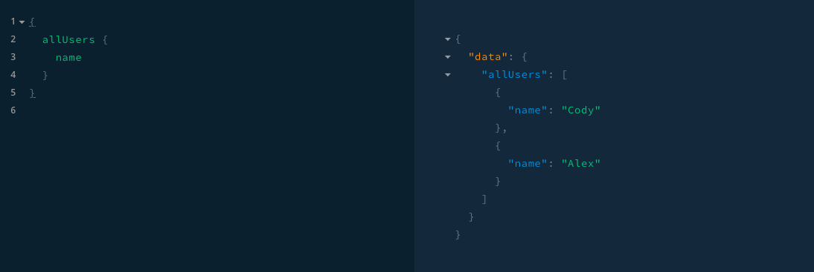
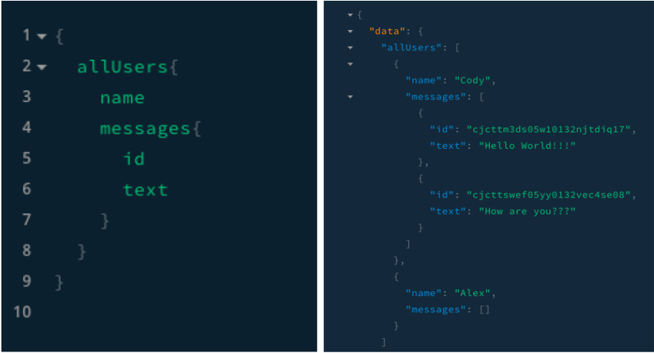
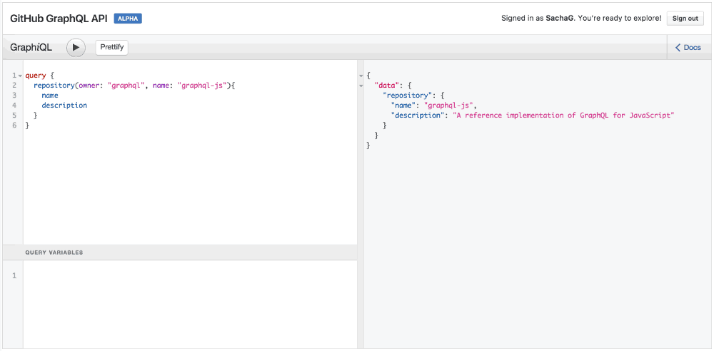
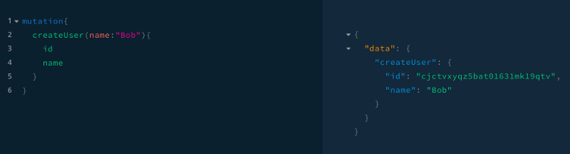
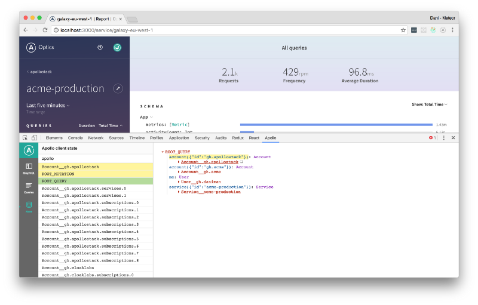

## GraphQL
1. Giới thiệu về GraphQL
   * GraphQL là một Graph Query Language được dành cho API. Nó được phát triển bởi Facebook và hiện tại nó được duy trì bởi rất nhiều công ty lớn, và mọi cá nhân trên khắp thế giới. GraphQL từ khi ra đời đã gần như thay thế hoàn toàn REST bởi sự hiệu quả, mạnh mẽ và linh hoạt hơn rất nhiều.
   * GraphQL là một cú pháp mô tả cách yêu cầu lấy dữ liệu, và thường được dùng để load data từ một server cho client. GraphQL bao gồm 3 điểm đặc trưng bao gồm cho phép client xác định chính xác những gì dữ liệu họ cần, làm cho việc tổng hợp dữ liệu từ nhiều nguồn dễ dàng hơn và nó sử dụng một type system để mô tả dữ liệu.
          
        
2. Điểm mạnh
    * Lấy Facebook làm ví dụ. Facebook phải quản lí vô số data source và API clients mà REST API lại lộ khuyết điểm thiếu linh hoạt do tính chất dựa trên tài nguyên cố định, dẫn đến trường hợp “nghẽn cổ chai” thường thấy. Chính vì vậy, thay vì có đến hàng tá “endpoint” dư thừa, Facebook đã nghĩ đến giải pháp chỉ dùng một “endpoint” thông minh với khả năng tiếp thu những Query phức tạp rồi đưa ra output data với loại type tùy theo yêu cầu của client. Nói đơn giản hơn, đây là truy vấn hướng client, cấu trúc dữ liệu không khô cứng 1 khuôn mẫu từ server (REST API) mà thay đổi theo từng ngữ cảnh sao cho hiệu quả nhất đối với client Ngoài ra, GraphQL hoàn toàn có thể create, update, delete, nhưng với cấu trúc sáng sủa và cấu trúc phân tầng nên lại càng thuận lợi cho lập trình viên phía client
        
    * Cấu trúc hướng client, nên cấu trúc dữ liệu không khô cứng và khuôn mẫu từ server. ngoài ra nó có thể create, update, delete nhưng cấu trúc dễ nhìn và phân tầng nên thuận lợi cho việc lập trình
    * So sánh cách mà GraphQL lấy dữ liệu về, lợi thế so với Rest:
      * Ví du: Ta có : thông tin 1 cuốn sách được khai báo như bên dưới (schema)  
        ```javascript
        type Book {
            id: ID!
            title: String!
            author: String!
            isbn: String!
            url: String!
        }
        ```
        * Query lấy thông tin sách đang có bao gồm (tiêu đề và tác giả)
            
        * Kết quả
            
        * Như đã thấy ở phần query, nếu chúng ta muốn thêm id hoặc bất kì field nào thì chúng ta chỉ cần khai báo chúng ở câu lệnh truy xuất, chứ không cần phải define nhiều resource. Và phần kết quả trả về cũng là dạng json giống như khi chúng ta sử dụng rest.
3. Lý do nên sử dụng GraphQL
    * Nguyên lý hoạt động: 
       * Chúng ta có thể hình dung bề nổi của tảng băng, giúp GraphQL hoạt động gồm 2 phần chính:
         * Schema Bản đồ chi tiết: mô tả của tất cả các trường, các mối quan hệ, các kiểu mà có thể sử dụng trong các truy vấn
         * Executor Một tay hướng đạo sinh: nhận mô tả ( truy vấn ) và sử dụng các bản đồ (schema) ở trên để dẫn đường tới đích (tới các data node ) và thu gom dữ liệu luôn, tất nhiên rồi.
    * Lý do sử dụng GraphQL thay cho các SQL khác.
      * Bản thân GraphQL cũng có những mối liên kết (relationship), nên việc sử dụng các dạng SQL khác thế chỗ GraphQL là điểu hiển nhiên có thể. Tuy nhiên, khi các mối quan hệ trở nên phức tạp, ví dụ như mối quan hệ của các pixel với màu trong bức ảnh, mối quan hệ của một mạng xã hội, mối quan hệ của các nguyên tử có trong phân tử của một chất nào đó, thì với các hệ SQL thông thường:
        * Việc lưu trữ và biểu diễn trở nên không hiệu quả.
        * Việc truy vấn trở nên lộn xộn, không dễ gì để giữ được format theo đúng chuẩn.
        * Khi các mối quan hệ trở nên trừu tượng, việc giữ các mối quan hệ đúng sẽ cần rất nhiều điều kiện.
      * Chính những hình mẫu kể trên đã dẫn tới yêu cầu của một hệ cơ sở dữ liệu có khả năng quản trị theo phương pháp hình học. GraphQL là một trong số đó.
    * So sánh GraphQL và RESTful
      * RESTful thực sự rất tuyệt vời! Tôi có thể khẳng định như vậy. Nhưng khi sự phát triển của mobile apps và web one-page-application ngày càng trở nên mạnh mẽ, RESTful bộc lộ những điểm yếu của nó:
        * Việc chia nhỏ theo resource khiến ta phải khởi tạo nhiều request cùng lúc để có thể lấy hết lượng data mong muốn hiển thị.
        * Khi dữ liệu có nhiều lớp, việc truy vấn trong database trở nên khó khăn, việc xuất dữ liệu ra trở nên kém hiệu quả bởi khả năng lặp lại dữ liệu cao.
        * Logic backend trở nên phức tạp và phình to nhanh chóng khi một API phục vụ cho nhiều application khác nhau.
        * Việc phát triển riêng biệt các component trong hệ thống vẫn còn khó khăn, bởi bất cứ thay đổi nào của một component, đều dẫn tới có thể ảnh hưởng tới các component còn lại. Ví dụ của tôi về mối quan hệ giữa backend dev và frontend dev là một minh chứng đơn giản.
      * Trong khi đó, với GraphQL
        * Tất cả data mong muốn có thể gộp chung vào một truy vấn, tới một endpoint duy nhất.
        * Với phương pháp duyệt cây, mỗi data node chỉ cần duyệt qua một lần duy nhất là đã có thể dùng cho mọi nơi trong data set, không phụ thuộc vào độ phức tạp của format dữ liệu.
        * Việc thay đổi phạm vi truy cập tới một trường nào đó cũng trở nên đơn giản, khả năng ảnh hưởng tới các phần khác thấp.
        * Việc phát triển riêng biệt các component trở nên hiện thực hơn bao giờ hết. 
4. Defining Schema and Type system
    * GraphQL có 1 hệ thống riêng dành cho nó được sử dụng để xác định schema của một api. Tất cả type được liệt kê trong một API thì được viết trong schema thì sử dụng GraphQL Schema Definition Language (SDL).
    * Schema này được dùng như là một bản giao dịch giữa client và server để xác định client có thể truy cập dữ liệu như thế nào. Sau đó team frontend có thể mock data để kiểm tra các component, song song đó team back-end cũng chuẩn bị công việc cần thiết cho phía server. Dưới nầy là một ví dụ về cách mà chúng ta có thể sử dụng SDL để xác định loại của User và Message:
    ```javascript
        type User @model {
            id: ID! @isUnique
            name: String!
            messages: [Message] @relation(name: "MessagesFromUser")
        }

        type Message @model {
            id: ID! @isUnique
            text: String!
            sentBy: User! @relation(name: "MessagesFromUser")
        }
    ```
    * Ví dụ:
      * Trong đoạn code trên sẽ lần lượt các field là id, name, messages ở model là User:
        * Với @model được xác định là một model của CSDL.
        * Dấu ! tượng trưng cho việc field đó không được để trống và bắt buộc phải có dữ liệu.
        * @isUnique có ý nghĩa là như là thuộc tính unique trong CSDL.
        * ID là trường được định nghĩa của hệ thống và chỉ được sử dụng nội bộ, do đó không được tạo ra các trường mới với loại ID.
        * String có nghĩa là khai báo kiểu dữ liệu của field đó là đạng String.
        * Với GraphQL nó có thể tạo ra các mối liên kết giữa các type với nhau. Vì vậy User có trường messages là một mảng của Message và tương tự như Message có trường sentBy liên kết với bảng User.
5. Fetching Data (Query)
    * GraphQL sử dụng việc nạp dữ liệu khác với REST. Nó chỉ có duy nhất 1 single endpont và hoàn toàn phụ thuộc vào client để xác định những dữ liệu cần thiết. Vì thế client phải chỉ ra các trường cần thiết, như ví dụ dưới đây:
     
    * Ở ví dụ này, phía bên trái là có gọi allUser là một query mà được sử dụng để muốn biết thông tin của một User. Như bạn có thể thấy trong query này, mình đã định nghĩa trường name, vì vậy ở kêt quả trả về phía bên tay phải chỉ duy nhất 1 trường name mà thôi Và chúng ta có thêm một ví dụ nữa như sau:
      
    * Ví dụ 2:  
      ```javascript
        query {
            post(id: "123foo"){
                title
                body
                author{
                name
                avatarUrl
                profileUrl
                }
            }
        }

        query getMyPost($id: String) {
            post(id: $id){
                title
                body
                author{
                name
                avatarUrl
                profileUrl
                }
            }
        }
      ```
      
      
6. Mutation  
    * Bây giờ chúng ta đã biết cách fetch dữ liệu với GraphQL. Bây giờ mình sẽ giới thiệu làm sao để gửi một data lên. Trong GraphQL viêc gửi các queries được gọi là mutations. Các mutation này có 3 loại là CREATE, UPDATE và DELETE. Mutation cũng có cú pháp giống như Fetching Data(Query). Nhưng mutation luôn bắt đầu với một từ khóa. Như ví dụ dưới đây:
        
7. Subscription and Realtime Updates:
    * Một yêu cầu quan trọng khác đối với nhiều ứng dụng đó chính là realtime, để có thể kết nối đến máy chủ để có được thông tin về các event ngay lập tức. Trong trường hợp này, GraphQL cung cấp các khái niệm gọi là subscriptions. Khi 1 client subscriptions một event, nó cũng bắt đầu và giữ các kết nối đến server. Bất cứ khi nào sự kiện đó xảy ra, server sẽ đẩy dữ liệu tương ứng đến client. Không giống như Query và Mutation, nó đi theo kiểu như “request-response-cycle”, nó sẽ subscriptions đại diện của luồng dữ liệu được gửi đến client. Subscriptions được viết bằng cách sử dụng cú pháp như Query và Mutation. Như ví dụ dưới đây:  
    ```javascript
        subscription {
             newUser {
                name
            }
        }
    ```  
    * Sau khi client gửi một subscription đến server, 1 kết nối sẽ được mở giữa chúng. Sau đó bất cứ khi nào có 1 mutaition được tạo ra bởi một new User, server sẽ gửi thoognt in về người dùng đó đến client.
8. Resolver
    * Resolver nói cho GraphQL biết nơi và cách thức để lấy data cần thiết cho field của query mà bạn yêu cầu. Sau đây là một resolver cho field post ở trên (sử dụng Apollo’s GraphQL-Tools schema generator):  
        ```javascript
            Query: {
                post(root, args) {
                    return Posts.find({ id: args.id });
                }
            }
        ```
    * Ta đặt resolver ngay trong Query bởi vì ta muốn query cho post ngay lập tức. Tuy nhiên, bạn vẫn có thể dùng resolver trong sub-field, như author field của post:  
        ```javascript 
            Query: {
                post(root, args) {
                    return Posts.find({ id: args.id });
                }
            },
            Post: {
                author(post) {
                    return Users.find({ id: post.authorId})
                }
            }
        ``` 
    * Nhớ lưu ý rằng resolver sẽ không bị giới hạn bởi trong số lượng thông tin được đưa về nên bạn sẽ muốn thêm commentsCount cho Post type:  
        ```javascript
            Post: {
                author(post) {
                    return Users.find({ id: post.authorId})
                },
                commentsCount(post) {
                    return Comments.find({ postId: post.id}).count() 
                }
            }
        ```
    * Điều quan trong bạn cần hiểu ở đây là với GraphQL, API schema của bạn và database schema sẽ bị chia ra riêng biệt. Nói cách khác, có thể sẽ không có bất kì author và commentsCount nào trong database của mình nhưng ta vẫn có thể “mô phỏng” chúng nhờ vào resolver.
    * Bạn có thể viết bất kì code gì trong resolver, vì thế mà bạn có thể dùng chúng để sửa đổi nội dung của database, vốn còn được gọi là mutation resolver.   
9.  Ví dụ đầy đủ  
    ```javascript
        type Query {
            allUsers: [User!]!
        }

        type Mutation {
            createUser(name: String!): User!
        }

        type Subscription {
            newUser: User!
        }

        type User @model {
            id: ID! @isUnique
            name: String!
            messages: [Message] @relation(name: "MessagesFromUser")
        }

        type Message @model {
            id: ID! @isUnique
            text: String!
            sentBy: User! @relation(name: "MessagesFromUser")
        }
    ```
10. GraphQL client
    * Apollo Client
      * Dù chỉ mới xuất hiện nhưng đã nhanh chóng soán ngôi bá chủ, Apollo client thường bao gồm 2 yếu tố sau:
        * Apollo Client, dùng để chạy GraphQL query trên các trình duyệt web cũng như lưu trữ data của họ.
        * Một kết nối cho front-end framework của bạn (React-Apollo, Angular-Apollo, etc.)  
      * Cần nhớ rằng nếu để ở chế độ default, Apollo-client sẽ lưu dữ liệu của nó bằng Redux, một library khá tốt với hệ ecosystem đa dạng.  
         
11. Các extensions và tool hỗ trợ
   * GraphiQL: Là công cụ mình đã giới thiệu bên trên, sử dụng trình duyệt được xây dựng dựa trên React, GraphiQL cũng có thể được nối với CSS cho việc xây dựng tùy chỉnh.
   * GraphQL Voyager: Thể hiện GraphQL API dưới dạng biểu đồ tương tác giúp các bạn nhìn thấy mối tương quan giữa các dữ liệu
   * Graph CMS: Xây dựng một GraphQL Content API trong vài phút GraphCMS là một hệ thống quản lý nội dung (CMS) API mà gắn liền với GraphQL.
   * GraphQL Docs: Tài liệu ngắn gọn dễ hiểu cho GraphQL API Cần một tài liệu tĩnh cho giản đồ GraphQL API
   * Graphcool: Back-end hỗ trợ linh hoạt kết hợp GraphQL + AWS Lambda Với kiến trúc linh hoạt, khả năng mở rộng, không cần máy chủ, có một back-end được hình thành trước là một triển vọng thú vị. 