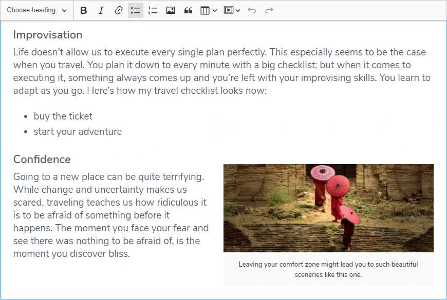

### Tìm hiểu về RichText Editor in React
---
### RichText Editor là gì?
* **RichText Editor**  là giao diện để chỉnh sửa văn bản định dạng trong các trình duyệt web , mà quà cho người dùng một "what-you-see-is-what-you-get" (WYSIWYG) khu vực chỉnh sửa. Mục đích là để giảm nỗ lực cho người dùng đang cố gắng thể hiện định dạng của họ trực tiếp dưới dạng đánh dấu HTML hợp lệ .
* Mặc dù các trình duyệt ban đầu có thể hiển thị văn bản phong phú, việc nhập dữ liệu người dùng bị giới hạn ở các hộp văn bản với một phông chữ và kiểu duy nhất (được triển khai với textarea phần tử HTML). Internet Explorer là người đầu tiên thêm "designMode" đặc biệt cho phép người dùng định dạng các phần của tài liệu được chỉnh sửa bằng con trỏ . Mozilla theo sau trong phiên bản 1.3, [1] và hầu hết các trình duyệt chính hiện nay đều thực hiện tiêu chuẩn không chính thức này trong một số khả năng.
* Các khả năng kỹ thuật cần thiết để triển khai trình soạn thảo văn bản phong phú trực tuyến không được bao gồm trong thông số kỹ thuật của W3C cho HTML4 . Tuy nhiên, các dịch vụ phổ biến như Gmail và WordPress đã dựa vào chỉnh sửa văn bản phong phú làm giao diện người dùng chính của họ. Với HTML5 , một số tiêu chuẩn hóa đã được thực hiện trên một thuộc tính DOM có tên là "contentEditable" giống như phần mở rộng ban đầu của Internet Explorer. [3] Nhiều bộ ứng dụng văn phòng trực tuyến có xu hướng cung cấp chức năng chỉnh sửa và định dạng văn bản trực tuyến.
### Những thư viện RichText Editor in React
* **React Quill**
    * 
    * Quill là trình soạn thảo WYSIWYG mã nguồn mở , miễn phí được xây dựng cho web hiện đại. Với kiến trúc mở rộng và API biểu cảm, bạn hoàn toàn có thể tùy chỉnh nó để đáp ứng nhu cầu của bạn. Một số tính năng được tích hợp bao gồm:

        + Nhanh và nhẹ
        + Đánh dấu ngữ nghĩa
        + HTML được chuẩn hóa giữa các trình duyệt
        + Hỗ trợ trình duyệt chéo bao gồm Chrome, Firefox, Safari và IE 9+
    * Cài đặt: *npm install react-quill --save*
    * Sử dụng:
    https://github.com/zenoamaro/react-quill
     
* **React Draft WYSIWYG**
    * 
    * React Draft Wysiwyg là một thành phần soạn thảo văn bản phong phú dựa trên Draft.js. Nó có tính năng:

        + Thanh công cụ cấu hình với tùy chọn để thêm / xóa điều khiển.
        + Tùy chọn để thay đổi thứ tự của các điều khiển  trong thanh công cụ.
        + Tùy chọn để thêm các điều khiển tùy chỉnh vào thanh công cụ.
        + Tùy chọn để thay đổi kiểu và biểu tượng trong thanh công cụ.
        + Tùy chọn để hiển thị có điều kiện ẩn thanh công cụ.
        + Hỗ trợ cho các kiểu nội tuyến: In đậm, in nghiêng, gạch chân, StrikeTh khóa, mã, đăng ký, siêu ký tự.
        + Hỗ trợ cho các loại khối: Đoạn, H1 - H6, Blockquote, Code.
        + Hỗ trợ cài đặt kích thước phông chữ và họ phông chữ và tùy chọn để thêm các loại tùy chỉnh.
        + Hỗ trợ cho các danh sách được sắp xếp / không có thứ tự và thụt lề.
        + Hỗ trợ căn chỉnh văn bản.
        + Hỗ trợ tô màu văn bản hoặc nền và tùy chọn để thêm các giá trị màu của riêng bạn.
        + Hỗ trợ thêm / chỉnh sửa liên kết
        + Lựa chọn hơn 150 biểu tượng cảm xúc và tùy chọn để thêm biểu tượng cảm xúc unicode của riêng bạn.
        + Hỗ trợ cho đề cập.
        + Hỗ trợ cho hashtag.
        + Hỗ trợ thêm / tải lên hình ảnh.
        + Hỗ trợ căn chỉnh hình ảnh, thiết lập chiều cao, chiều rộng.
        + Hỗ trợ cho các liên kết nhúng, linh hoạt để thiết lập chiều cao và chiều rộng.
        + Tùy chọn được cung cấp để loại bỏ thêm kiểu dáng.
        + Tùy chọn hoàn tác và làm lại.
        + Hành vi có thể cấu hình cho RTL và Spellcheck.
        + Hỗ trợ cho giữ chỗ.
        + Hỗ trợ cho các thuộc tính Hỗ trợ của WAI-ARIA
        + Sử dụng trình soạn thảo như thành phần React được kiểm soát hoặc không được kiểm soát.
        + Hỗ trợ chuyển đổi Nội dung Trình chỉnh sửa sang HTML, JSON, Markdown.
        + Hỗ trợ chuyển đổi HTML được tạo bởi trình chỉnh sửa trở lại nội dung trình chỉnh sửa.
        + Hỗ trợ quốc tế hóa.
    * Cài đặt:  *npm install --save react-draft-wysiwyg draft-js*
    * Sử dụng: 
* **React RTE**
    * 
    * Đây là một thành phần UI được xây dựng hoàn toàn trong React có nghĩa là một sự thay thế textarea đầy đủ tính năng tương tự như  CKEditor ,  TinyMCE  và các trình soạn thảo "WYSIWYG" văn bản phong phú khác  . Nó dựa trên Draft.js mã nguồn mở tuyệt vời   từ Facebook, được trình diễn và thử nghiệm sản xuất.

    * RichTextEditor là thành phần biên tập chính. Nó bao gồm Draft.js , một số thành phần UI (ví dụ: thanh công cụ) và một số tóm tắt hữu ích xung quanh việc lấy và thiết lập nội dung với HTML / Markdown. được thiết kế để được sử dụng như một ngoại trừ thay vì là một chuỗi, nó là một đối tượng với nó.
    * Cài đặt: *npm install --save react-rte*
    * Sử dụng: https://github.com/sstur/react-rte
* **CKEditor React**
    * 
    * Trình soạn thảo văn bản JavaScript hiện đại với kiến ​​trúc mô đun. Giao diện người dùng sạch và các tính năng của nó cung cấp WYSIWYG UX hoàn hảo để tạo nội dung ngữ nghĩa.

        + Được viết bằng ES6 với kiến ​​trúc MVC, mô hình dữ liệu tùy chỉnh, DOM ảo.
        + Hình ảnh phản hồi và phương tiện truyền thông nhúng (video, tweet).
        + Định dạng đầu ra tùy chỉnh: Hỗ trợ HTML và Markdown.
        + Tăng năng suất với định dạng tự động và cộng tác.
        + Mở rộng và tùy biến theo thiết kế.
    * Cài đặt: *npm i @ckeditor/ckeditor5-react*
    * Sử dụng: https://github.com/ckeditor/ckeditor5-react
* **CTinyMCE React**
    * 
    * TinyMCE là một trình điều khiển trình soạn thảo WYSIWYG dựa trên nền tảng độc lập trên nền tảng web được phát hành dưới dạng Nguồn mở theo LGPL. Các nhà phát triển có thể sử dụng TinyMCE trong các dự án web của riêng họ để cho phép người dùng cuối thêm / chỉnh sửa nội dung vào trang web hoặc ứng dụng khác. TinyMCE có thể tùy chỉnh, do đó bạn có thể chỉ định các nút nào đi trên thanh công cụ, v.v. Nhiều tùy chọn thanh công cụ có sẵn dưới dạng plugin và bạn chỉ cần thêm các tham số thích hợp từ trong JavaScript khi bạn gọi trình soạn thảo. Dự án chính thức cũng cung cấp một thành phần React mà bạn có thể dễ dàng cài đặt và sử dụng trong dự án của mình.
    * Cài đặt: *npm install -g create-react-app*
    * Sử dụng: https://www.tiny.cloud/docs/integrations/react/
        

