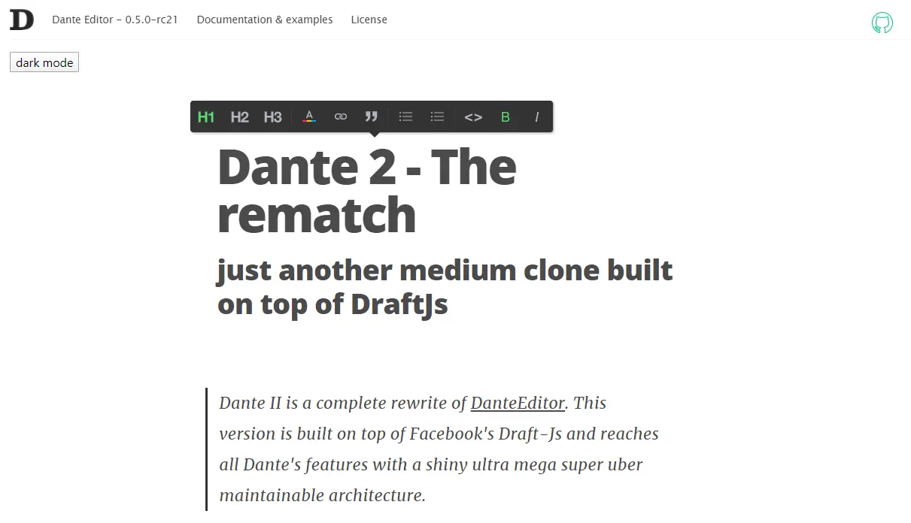
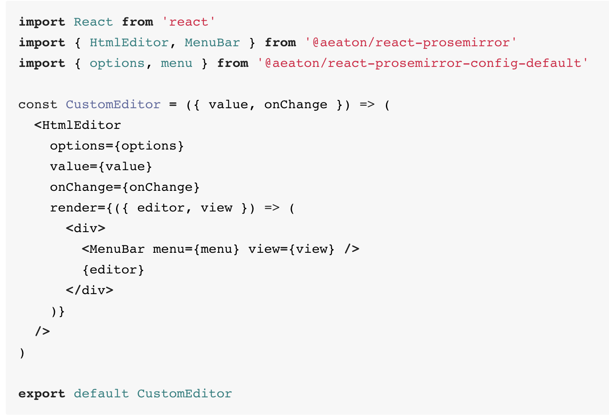

### Tìm hiểu về RichText Editor in React
---
### RichText Editor là gì?
* **RichText Editor**  là giao diện để chỉnh sửa văn bản định dạng trong các trình duyệt web , mà quà cho người dùng một "what-you-see-is-what-you-get" (WYSIWYG) khu vực chỉnh sửa. Mục đích là để giảm nỗ lực cho người dùng đang cố gắng thể hiện định dạng của họ trực tiếp dưới dạng đánh dấu HTML hợp lệ . 
* Mặc dù các trình duyệt ban đầu có thể hiển thị văn bản phong phú, việc nhập dữ liệu người dùng bị giới hạn ở các hộp văn bản với một phông chữ và kiểu duy nhất (được triển khai với textarea phần tử HTML). Internet Explorer là người đầu tiên thêm "designMode" đặc biệt cho phép người dùng định dạng các phần của tài liệu được chỉnh sửa bằng con trỏ . Mozilla theo sau trong phiên bản 1.3, [1] và hầu hết các trình duyệt chính hiện nay đều thực hiện tiêu chuẩn không chính thức này trong một số khả năng.
* Các khả năng kỹ thuật cần thiết để triển khai trình soạn thảo văn bản phong phú trực tuyến không được bao gồm trong thông số kỹ thuật của W3C cho HTML4 . Tuy nhiên, các dịch vụ phổ biến như Gmail và WordPress đã dựa vào chỉnh sửa văn bản phong phú làm giao diện người dùng chính của họ. Với HTML5 , một số tiêu chuẩn hóa đã được thực hiện trên một thuộc tính DOM có tên là "contentEditable" giống như phần mở rộng ban đầu của Internet Explorer. [3] Nhiều bộ ứng dụng văn phòng trực tuyến có xu hướng cung cấp chức năng chỉnh sửa và định dạng văn bản trực tuyến.
### Những thư viện RichText Editor in React
* **Jodit React** 
    
    * Jodit là một trình soạn thảo WYSIWYG mã nguồn mở tuyệt vời được viết bằng TypeScript thuần túy mà không cần sử dụng các thư viện bổ sung.
    + Cài đặt: *npm install jodit-react --save*
    + Sử dụng: 
        
* **Alloy Editor React**
    
    * Trình chỉnh sửa WYSIWYG dựa trên CKEditor với giao diện người dùng được viết lại hoàn toàn. Nó có tính năng:

        + Thanh công cụ thông minh xuất hiện ngay gần văn bản đã chọn và cung cấp chức năng khác nhau dựa trên ngữ cảnh
        + Dễ dàng thêm các nút của riêng bạn (xem ví dụ "marquee" trong tài liệu ) 
        + Dán hình ảnh từ clipboard hoặc Kéo và thả chúng từ một ứng dụng khác
        + Chèn hình ảnh từ máy ảnh của thiết bị!
        + Dán văn bản phong phú từ bất kỳ trang web nào và giữ nguyên định dạng của nó
        + Sức mạnh tạo kiểu đầy đủ của CKEditor với giao diện người dùng hiện đại hơn nhiều
        + Lõi được tách biệt hoàn toàn với UI
        + UI ví dụ được xây dựng với React
        + Kiến trúc plugin
    * Cài đặt: *npm i alloyeditor*
    * Sử dụng: https://alloyeditor.com/docs/develop/about.html
* **Suneditor React**
    * 
    * Thư viện này cung cấp dưới dạng React Component for SunEditor. Suneditor là trình soạn thảo văn bản WYSIWYG nhẹ, linh hoạt, có thể tùy chỉnh cho các ứng dụng web của bạn.

        + Dán từ Microsoft Word và Excel.
        + Lựa chọn bảng tùy chỉnh, hợp nhất và phân chia.
        + Phương tiện truyền thông nhúng, tải lên hình ảnh.
        + Có thể sử dụng CodeMirror.
    * Cài đặt: *npm install --save suneditor-react*
    *Sử dụng:  
        + https://www.npmjs.com/package/suneditor-react
* **Slate** 
    * 
    * Một khung hoàn toàn tùy biến để xây dựng các trình soạn thảo văn bản phong phú. (Hiện đang ở giai đoạn thử nghiệm.) Slate cho phép bạn xây dựng các trình soạn thảo trực quan, phong phú như các trình duyệt trong Medium, Dropbox Paper hoặc Google Docs, đang trở thành cổ phần bảng cho các ứng dụng trên web mà không cần codebase của bạn bị phức tạp. Nó có thể làm điều này bởi vì tất cả logic của nó được triển khai với một loạt các plugin, vì vậy bạn không bao giờ bị hạn chế bởi những gì là hoặc không có trong "core". Bạn có thể nghĩ về nó giống như một triển khai có thể cắm được của nội dung có thể được xây dựng dựa trên React và bất biến. Nó được lấy cảm hứng từ các thư viện như Draft.js, Prosemirror và Quill
    * Cài đặt: *npm i slate-react*
    * Sử dụng: https://github.com/ianstormtaylor/slate
* **React Froala WYSIWYG** 
    *
    * React-froala-wyswiyg cung cấp các ràng buộc React cho trình soạn thảo Froala WYSIWYG VERSION 2. Froala Editor là một trình chỉnh sửa web Javascript đẹp, dễ tích hợp cho các nhà phát triển và người dùng của bạn sẽ yêu thích thiết kế sạch sẽ của nó.
    * Cài đặt: *npm install react-froala-wysiwyg --save*
    * Sử dụng: https://www.npmjs.com/package/react-froala-wysiwyg
* **React Summernote** 
    
    * Summernote là một trình soạn thảo bootstrap wysiwyg siêu đơn giản. Yêu cầu bootstrap và jQuery, Summernote hỗ trợ các tính năng tự động hoàn thành, gợi ý giúp gõ.
    * Cài đặt: *npm install react-summernote*
    * Sử dụng: https://www.npmjs.com/package/react-summernote
* **React Quill** 
    
    * Quill là trình soạn thảo WYSIWYG mã nguồn mở , miễn phí được xây dựng cho web hiện đại. Với kiến trúc mở rộng và API biểu cảm, bạn hoàn toàn có thể tùy chỉnh nó để đáp ứng nhu cầu của bạn. Một số tính năng được tích hợp bao gồm:

        + Nhanh và nhẹ
        + Đánh dấu ngữ nghĩa
        + HTML được chuẩn hóa giữa các trình duyệt
        + Hỗ trợ trình duyệt chéo bao gồm Chrome, Firefox, Safari và IE 9+
    * Cài đặt: *npm install react-quill --save*
    * Sử dụng:
    https://github.com/zenoamaro/react-quill
     
* **Dante2** 
    
    * Dante2 là một bản viết lại hoàn chỉnh của trình soạn thảo dante trong draft-js (chỉ là một bản sao trung bình khác được xây dựng trên đỉnh của DraftJs). Phiên bản trước của Dante phụ thuộc rất nhiều vào thao tác DOM, điều này gây ra sự pha trộn giữa trình bày và logic. Ngay cả với hệ thống plugin mô-đun của họ, điều kiện này vẫn cho rằng một mô hình sphagetti hoạt động với mọi tính năng. Vấn đề lớn nhất với cách tiếp cận này là: nếu bạn muốn thực hiện thay đổi ảnh hưởng đến việc trình bày nội dung người dùng của mình, giả sử bạn có thể muốn thay đổi đánh dấu mặc định cho các đoạn văn, có lẽ bạn sẽ kết thúc cập nhật tất cả nội dung trong cơ sở dữ liệu của mình, bởi vì giao dịch với "chỉ DOM" giả sử rằng bạn sẽ lưu html vào cơ sở dữ liệu.
    * Cài đặt: *npm install Dante2@next* or *yarn add Dante2@next*
    * Sử dụng: https://github.com/michelson/dante2
    
* **React Draft WYSIWYG** 
    
    * React Draft Wysiwyg là một thành phần soạn thảo văn bản phong phú dựa trên Draft.js. Nó có tính năng:

        + Thanh công cụ cấu hình với tùy chọn để thêm / xóa điều khiển.
        + Tùy chọn để thay đổi thứ tự của các điều khiển  trong thanh công cụ.
        + Tùy chọn để thêm các điều khiển tùy chỉnh vào thanh công cụ.
        + Tùy chọn để thay đổi kiểu và biểu tượng trong thanh công cụ.
        + Tùy chọn để hiển thị có điều kiện ẩn thanh công cụ.
        + Hỗ trợ cho các kiểu nội tuyến: In đậm, in nghiêng, gạch chân, StrikeTh khóa, mã, đăng ký, siêu ký tự.
        + Hỗ trợ cho các loại khối: Đoạn, H1 - H6, Blockquote, Code.
        + Hỗ trợ cài đặt kích thước phông chữ và họ phông chữ và tùy chọn để thêm các loại tùy chỉnh.
        + Hỗ trợ cho các danh sách được sắp xếp / không có thứ tự và thụt lề.
        + Hỗ trợ căn chỉnh văn bản.
        + Hỗ trợ tô màu văn bản hoặc nền và tùy chọn để thêm các giá trị màu của riêng bạn.
        + Hỗ trợ thêm / chỉnh sửa liên kết
        + Lựa chọn hơn 150 biểu tượng cảm xúc và tùy chọn để thêm biểu tượng cảm xúc unicode của riêng bạn.
        + Hỗ trợ cho đề cập.
        + Hỗ trợ cho hashtag.
        + Hỗ trợ thêm / tải lên hình ảnh.
        + Hỗ trợ căn chỉnh hình ảnh, thiết lập chiều cao, chiều rộng.
        + Hỗ trợ cho các liên kết nhúng, linh hoạt để thiết lập chiều cao và chiều rộng.
        + Tùy chọn được cung cấp để loại bỏ thêm kiểu dáng.
        + Tùy chọn hoàn tác và làm lại.
        + Hành vi có thể cấu hình cho RTL và Spellcheck.
        + Hỗ trợ cho giữ chỗ.
        + Hỗ trợ cho các thuộc tính Hỗ trợ của WAI-ARIA
        + Sử dụng trình soạn thảo như thành phần React được kiểm soát hoặc không được kiểm soát.
        + Hỗ trợ chuyển đổi Nội dung Trình chỉnh sửa sang HTML, JSON, Markdown.
        + Hỗ trợ chuyển đổi HTML được tạo bởi trình chỉnh sửa trở lại nội dung trình chỉnh sửa.
        + Hỗ trợ quốc tế hóa.
    * Cài đặt:  *npm install --save react-draft-wysiwyg draft-js*
    * Sử dụng: 
* **React Prosemirror**
    
    * Một bộ công cụ để xây dựng các trình soạn thảo văn bản phong phú trên web. Một trình soạn thảo nội dung lý tưởng tạo ra các tài liệu có cấu trúc, có ý nghĩa về mặt ngữ nghĩa, nhưng làm như vậy theo cách dễ hiểu cho người dùng. ProseMirror cố gắng thu hẹp khoảng cách giữa chỉnh sửa văn bản Markdown và các trình soạn thảo WYSIWYG cổ điển .    

    * Nó thực hiện điều này bằng cách triển khai giao diện chỉnh sửa theo kiểu WYSIWYG cho các tài liệu bị ràng buộc và có cấu trúc hơn so với HTML đơn giản. Bạn có thể tùy chỉnh hình dạng và cấu trúc của tài liệu mà trình soạn thảo của bạn tạo và điều chỉnh chúng theo nhu cầu của ứng dụng.
    * Cài đặt: *npm install @aeaton/react-prosemirror --save* or *yarn add @aeaton/react-prosemirror*
    * Sử dụng: 
        + Add menu: 
* **React RTE**
    
    * Đây là một thành phần UI được xây dựng hoàn toàn trong React có nghĩa là một sự thay thế textarea đầy đủ tính năng tương tự như  CKEditor ,  TinyMCE  và các trình soạn thảo "WYSIWYG" văn bản phong phú khác  . Nó dựa trên Draft.js mã nguồn mở tuyệt vời   từ Facebook, được trình diễn và thử nghiệm sản xuất. 

    * RichTextEditor là thành phần biên tập chính. Nó bao gồm Draft.js , một số thành phần UI (ví dụ: thanh công cụ) và một số tóm tắt hữu ích xung quanh việc lấy và thiết lập nội dung với HTML / Markdown. được thiết kế để được sử dụng như một ngoại trừ thay vì là một chuỗi, nó là một đối tượng với nó.
    * Cài đặt: *npm install --save react-rte*
    * Sử dụng: https://github.com/sstur/react-rte
* **CKEditor React**
    
    * Trình soạn thảo văn bản JavaScript hiện đại với kiến ​​trúc mô đun. Giao diện người dùng sạch và các tính năng của nó cung cấp WYSIWYG UX hoàn hảo để tạo nội dung ngữ nghĩa.

        + Được viết bằng ES6 với kiến ​​trúc MVC, mô hình dữ liệu tùy chỉnh, DOM ảo.
        + Hình ảnh phản hồi và phương tiện truyền thông nhúng (video, tweet).
        + Định dạng đầu ra tùy chỉnh: Hỗ trợ HTML và Markdown.
        + Tăng năng suất với định dạng tự động và cộng tác.
        + Mở rộng và tùy biến theo thiết kế.
    * Cài đặt: *npm i @ckeditor/ckeditor5-react*
    * Sử dụng: https://github.com/ckeditor/ckeditor5-react
* **CTinyMCE React**
    
    * TinyMCE là một trình điều khiển trình soạn thảo WYSIWYG dựa trên nền tảng độc lập trên nền tảng web được phát hành dưới dạng Nguồn mở theo LGPL. Các nhà phát triển có thể sử dụng TinyMCE trong các dự án web của riêng họ để cho phép người dùng cuối thêm / chỉnh sửa nội dung vào trang web hoặc ứng dụng khác. TinyMCE có thể tùy chỉnh, do đó bạn có thể chỉ định các nút nào đi trên thanh công cụ, v.v. Nhiều tùy chọn thanh công cụ có sẵn dưới dạng plugin và bạn chỉ cần thêm các tham số thích hợp từ trong JavaScript khi bạn gọi trình soạn thảo. Dự án chính thức cũng cung cấp một thành phần React mà bạn có thể dễ dàng cài đặt và sử dụng trong dự án của mình.
    * Cài đặt: *npm install -g create-react-app*
    * Sử dụng: https://www.tiny.cloud/docs/integrations/react/
        

    

    

    

