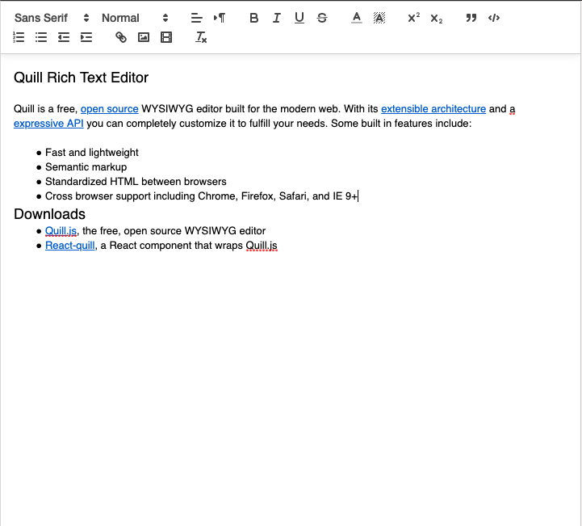
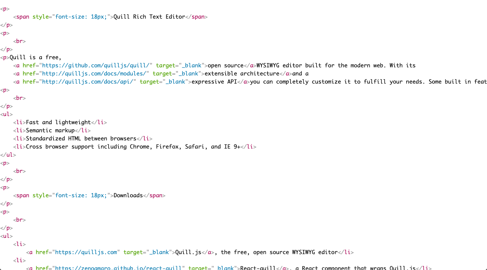

# RichText editor và một số thư viện phổ biến
- **RichText editor**: nó giống như là một trình soạn thảo văn bản.
- **WYSIWYG**(viết tắt của **What You See Is What You Get** trong tiếng Anh):  thường được dịch là "những gì bạn đang thấy là những gì bạn sẽ nhận được" và hiểu như là "Giao diện tương tác tức thời - mắt thấy tay làm", thường được dùng trong các chương trình ứng dụng văn phòng, các chương trình biên soạn, thiết kế web... 
- **Lib phổ biến**:
  1. [Quill](https://zenoamaro.github.io/react-quill/):
	   * Dễ tích hợp và sử dụng. Nó ngắn gọn và dễ hiểu
	   * Hướng dẫn cài đặt và cách sử dụng, xem [tại đây](https://www.npmjs.com/package/react-quill) hoăc [tại đây](http://somethingaboutme.info/bai-viet/duynguyen/[quill]-gioi-thieu-quill-rich-text-editor-va-tuy-bien-637165001994629090.html).
		* Điểm nổi bật:
		  * Thiết kế hướng API.
		  * Nội dung tuỳ chỉnh và đa dạng.
		  * Đa nền tảng.
		  * Dễ sử dụng.
        * Điểm yếu: Chưa thấy hỗ trợ trên thiết bị di động. Hầu hết các tính năng của Quill thì TinyMCE và CKEditor cũng có.
      * Hướng dẫn cài đặt sử dụng:  
        * Cài đặt: Dưới đây chúng ta sẽ xây dựng trên cơ sở của một website ReactJS.
          * Bước đầu tiên chúng ta khởi tạo một project ReactJs và các lib kèm theo của React đặc biệt là hai lib react và react-dom.
          * Bước hai chúng ta tiến hành add lib vào project của mình: **npm install react-quill --save** hoặc **yarn add react-quill**
          * Bước cuối chúng ta tiến hành xây dựng code và add quill vào website của mình như việc sử dụng các component bình thường khác. Nhưng lưu ý nhớ import đầy đủ các thư viện và module cần thiết.
            * Ví dụ:
			```javascript
			import React from 'react';
			import ReactQuill from 'react-quill';
			import 'react-quill/dist/quill.snow.css';

			function MyComponent() {
  				const [value, setValue] = useState('');
				return (
					<ReactQuill theme="snow" value={value} onChange={setValue}/>
				);
				}
			```
        * Sử dụng: 
          * Chúng ta có thể truy cập vào các website có hỗ trợ Quill trong việc soạn thảo điển hình là hai website được đề cập dưới đây [website 1](https://zenoamaro.github.io/react-quill/) và [website 2](http://somethingaboutme.info/bai-viet/duynguyen/[quill]-gioi-thieu-quill-rich-text-editor-va-tuy-bien-637165001994629090.html) để tiến hành thực hiện viết bài. Hoặc chúng ta có thể chạy project chúng ta đã khởi tạo bên trên để tiến hành viết trên local.
          * Ví dụ: chúng ta truy cập vào website 1 và tiến hành soạn thảo nội dung bài viết của chúng ta ở phần editor bên tay trái như hình phía bên dưới.
  			
          * Và đây sẽ là kết quả chúng ta có được:
			
  2. [TyniMCE](https://www.tiny.cloud/docs/demo/basic-example/#):
	   * Là một nền tảng JavaScript độc lập dựa trên HTML WYSIWYG. Nó cho phép bạn chuyển đổi các trường văn bản HTML hoặc các phần tử HTML khác thành các thể hiện trình soạn thảo. Bạn có thể tải lên và quản lý các tệp trên Microsoft Azure, Google Drive, Amazon S3, DropBox và hơn thế nữa. Nó tuân theo đặc tả WAI-ARIA, làm cho nó tương thích với các trình đọc màn hình như JAWS và NVDA. Ngoài ra còn có một giải pháp doanh nghiệp mà bạn nhận được sự hỗ trợ ưu tiên.
	   * Hướng dẫn cài đặt và sử dụng, xem [tại đây](https://techblog.vn/gioi-thieu-ve-tinymce).
	   * Điểm nổi bật:
	     * Nhúng phương tiện trực tiếp.
	     * Tích hợp chỉnh sửa ảnh.
	     * Kiểm tra chính tả( doanh nghiệp).
	     * Thân thiện với MS-Word.
	     * Hỗ trợ 40 ngôn ngữ.
	     * Hiệu suất Cross-Browser mạnh mẽ.
	     * Hỗ trợ trên nền tảng di động.
	   * Điểm yếu: Do hỗ trợ khá nhiều tính năng nên editor này sẽ khá nặng hơn các editor khác.
  3. [CKEditor](https://nightly.ckeditor.com/20-04-09-06-04/full/samples/index.html):
	   * Là một trình soạn thảo văn bản HTML sẵn sàng để sử dụng được thiết kế để đơn giản hóa việc tạo nội dung web. Nó mang các tính năng xử lý văn bản phổ biến trực tiếp đến các trang web của bạn.
           * Hướng dẫn cài đặt và sử dụng, xem [tại đây](https://o7planning.org/vi/10369/huong-dan-su-dung-trinh-soan-thao-ckeditor).
           * Điểm nổi bật:
		     * Tùy chỉnh xây dựng bằng cách sử dụng CKBuilder.
		     * MS Word thân thiện.
		     * Hoàn tác / làm lại hỗ trợ.
		     * Hỗ trợ khoảng 60 ngôn ngữ.
		     * Hỗ trợ RTL.
		     * Hỗ trợ trên nền tảng di động.
		   * Điểm yếu: Do hỗ trợ khá nhiều tính năng nên editor này sẽ khá nặng hơn các editor khác.
