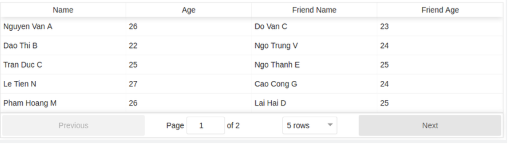

## Tìm hiểu về các UI Component

## Dropdown

* Cho phép người dùng chọn một giá trị từ danh sách. Khi danh sách thả xuống không hoạt động, nó sẽ hiển thị một giá trị. Khi được kích hoạt, nó sẽ hiển thị (thả xuống) một danh sách các giá trị, từ đó người dùng có thể chọn một giá trị. Khi người dùng chọn một giá trị mới, danh sách sẽ trở về trạng thái không hoạt động, hiển thị giá trị được chọn

* Vd:
Web: shibui-dropdown-menu by ShibuiElements, simple-dropdown by SimpleElements, tsante-dropdown by telecomsante
Mobile: react-native-dropdown, react-native-modal-dropdown

## Accordion

* Cho phép người dùng sắp xếp danh sách theo chiều dọc, mỗi mục có thể được mở rộng hoặc thu nhỏ đi kèm với nội dung bên trong của mỗi mục. Có thể có 0 mục được mở (tất cả các mục đều trọng trạng thái đóng), có thể chỉ duy nhất một mục đc mở các mục còn lại phải đóng hoặc có thể mở một lúc nhiều mục (tuỳ theo cấu hình code).

* Vd:
Web: react-accessible-accordion
Mobile: react-native-collapsible

## Breadcrumb

* Là một menu điều hướng (navigation menu) nằm ngang, nó giúp người dùng hình dung được vị trí trang hiện tại mà họ đang truy cập. Breadcrumb thường được sử dụng trong các website có số lượng trang lớn, và có sự phân cấp về nội dung, chẳng hạn như các website hướng dẫn, tra cứu,...

* Vd:
Web: react-breadcrumbs-dynamic
Mobile: react-native-breadcrumb,
react-native-customizable-breadcrumb

## Table

* Là sự sắp xếp dữ liệu theo hàng và cột. Thường được sử dụng khi dữ liệu bao gồm nhiều field.

## Tooltip

* Là một chú thích xuất hiện khi rê chuột lên 1 đối tượng nào đó như văn bản, hình ảnh, liên kết và các phần tử giao diện khác. Nội dung trong tooltip có thể là văn bản, hình ảnh hoặc thông tin nào đó. Mục đích của tooltip là nói cho người dùng biết đối tượng này dùng để làm gì hoặc hiển thị thêm thông tin của đối tượng được rê chuột vào. Chúng ra rất dễ dàng thấy ứng dụng này trên các site thương mại điện tử. Tooltip thường hiển thị thêm các thông tin về hình ảnh, thông số kỹ thuật, giá cả của sản phẩm mà bạn đang xem. Ưu điểm lớn nhất của tooltip không chỉ là hiển thị được thêm nhiều thông tin của đối tượng mà còn tiết kiệm được diện tích trên giao diện.

* Vd:
Web: react-tooltip
Mobile: rn-tooltip

## Alert

* Là một vùng không gian trang (page) hiển thị một thông điệp (message), thông điệp có thể là một thông tin hoặc một cảnh báo lỗi, ... (info, warning, danger,..). Khác với thành phần Model, Alert không hiển thị như một cửa sổ, nó là một vùng trên trang nhưng có thể có nút "x" giúp bạn có thể đóng vùng không gian này lại.

* Vd:
Web: react-alert
Mobile: alert in react-native

## Prompt

* Gần giống như Alert nhưng đi kèm theo một ô input để có thể lấy được giá trị từ người dùng (tương tác với người dùng).

## Notification

* Là một hình ảnh mang lại sự thông báo của người dùng. Lấy ví dụ từ facebook, sẽ xuất hiện các thông báo từ các icon ở góc của web facebook (các con số màu đỏ hoặc dấu chấm đỏ), làm nổi bật để ng dùng có thể dễ dàng nhận biết được có gì đó vừa thay đổi (có tin nhắn mới, có bài cập nhật mới, có người vừa tương tác với fb của mình).

* Vd:
Web: react-notifications-component
Mobile: react-native-push-notification-popup

## Pagination

* Là phân trang, điều hướng trang khi bạn có quá nhiều nội dung nhưng không thể để chúng cùng nằm hết trong một trang, bạn có thể chia ra nhiều trang, mỗi trang gồm bao nhiêu nội dung tùy theo sắp xếp của bạn, trên Pagination sẽ có đánh dấu số trang, nút next (trang tiếp theo) hoắc previous (trang trước đó).

* Vd:
Web: react-js-pagination
Mobile: react-native-pagination

## Parallax

* Là hiệu ứng mà hình nền của trang web sẽ di chuyển với những tốc độ khác nhau so với các đối tượng khác khi lăn chuột cuộn xuống hoặc lên. Thậm chí, một số trang web còn làm hiện ứng theo cách cuộn ngang. Lịch sử hình thành hiệu ứng này xuất phát điểm từ giao diện game nhưng trong những năm gần đây nó đã lan rộng và trở thành một xu thế mới trong thiết kế website hiện đại.

* Vd:
Mobile: react-native-parallax-scroll
Web: react-scroll-parallax

## Spinner

* Hiển thị trạng thái tải của một trang hoặc một phần, sử dụng khi một phần của trang đang chờ dữ liệu không đồng bộ hoặc trong quá trình kết xuất, một hình ảnh động tải thích hợp có thể làm giảm hiệu quả câu hỏi của người dùng.

* Vd:
Web: react-spinners
Mobile: react-native-loading-spinner-overlay

## Progress

* Hiển thị tiến trình hiện tại của một luồng hoạt động. Nếu mất nhiều thời gian để hoàn thành một thao tác, bạn có thể sử dụng Tiến trình để hiển thị tiến trình và trạng thái hiện tại. Khi một hoạt động sẽ làm gián đoạn giao diện hiện tại hoặc nó cần chạy trong nền trong hơn 2 giây. Khi bạn cần hiển thị phần trăm hoàn thành của một hoạt động.

* Vd:
Web: react-circular-progressbar
Mobile: react-native-progress

## Steps

* Là một thanh điều hướng hướng dẫn người dùng thông qua các bước của một tác vụ. Khi một tác vụ nhất định phức tạp hoặc có một chuỗi nhất định trong chuỗi các nhiệm vụ, chúng ta có thể phân tách nó thành nhiều bước để làm cho mọi việc dễ dàng hơn.

* Vd:
Mobile: react-native-step-indicator
Web: rc-steps

## React Table
* Cài đặt react-table: chạy lệnh npm install --save react-table
* Cách sử dụng:
    * Khai báo ReactTable: *import ReactTable from 'react-table*
    * Gọi css nếu muốn table đẹp hơn: *import 'react-table/react-table.css'*
* Ví dụ: 
    * Để hiển thị dữ liệu
        - const data = [{
  name: 'Nguyen Van A',
  age: 26,
  friend: {
    name: 'Do Van C',
    age: 23,
  }
}, {
  name: 'Dao Thi B',
  age: 22,
  friend: {
    name: 'Ngo Trung V',
    age: 24,
  }
}, {
  name: 'Tran Duc C',
  age: 25,
  friend: {
    name: 'Ngo Thanh E',
    age: 25,
  }
}];
    * Trước khi gọi component ra phải định dạng hiển thị cho các cột của bảng.
    
    * Sau khi có dữ liệu định dạng hiển thị, ta có thể gọi component ra.
    
    * Kết quả: 
    
* Một số option lúc gọi component hiển thị bản
    * data: [], // Dữ liệu đổ vào bảng
    * showPagination: boolean, // Hiển thị phân trang hay không
    * showPageSizeOptions: boolean, // Hiển thị selectbox thay đổi số bản ghi trên 1 trang hay không
    * pageSizeOptions: [5, 10, 20, 25, 50, 100], //  Các options cho selectbox số bản ghi trên 1 trang
    * defaultPageSize: integer, // Số bản ghi mặc định trên 1 trang
    * resizable: boolean, // Cho phép người dùng tự do thay đổi kích thước của các cột hay không
    * filterable: boolean, // Cho phép lọc dữ liệu hay không
    * defaultFilterMethod: (filter, row, column) => {return true}, // Hàm lọc mặc định nếu không bị override bởi hàm filterMethod ở từng cột
    * page: integer, // Hiển thị bảng ở trang số bao nhiêu

 Một số option cho định dạng cột

    * Cell: ({value}) => (value >= 18 ? 'Can watch video' : 'Cannot watch video') // Tùy biến lại component Cell, cách hiển thị của dữ liệu ở từng ô trong cột.
    * sortable: boolean // Cho phép sắp xếp theo cột này hay không?
    * filterable: boolean // Cho phép lọc theo cột này hay không?
    * filterMethod: (filter, row, column) => {return true} // Hàm lọc áp dụng khi lọc theo cột này
    * Filter: ({filter, onChange}) => (
    * <select
    value={filter ? filter.value : '0'}
    onChange={event => onChange(event.target.value)}
    >
    <option value='0' />
    <option value='1'>Option 1</option>
    <option value='2'>Option 2</option>
    * </select>
     ) // Tùy biến component Filter, hiển thị ra select box thay vì textbox. Hàm callback onChange truyền vào giá trị là filter.value cho hàm filterMethod.
* Tuỳ biến component TrGroupComponent
    * Ví dụ age > 25 tô màu:
        *  Định nghĩa component mới:
        
        * Gọi component ra:: 
        
        * Kết quả: 
        
## React-Virtualize
* Càng nhiều element được đưa vào trang, trình duyệt sẽ mất nhiều thời gian hơn để hiển thị nó và dẫn tới trải nghiệm người dùng sẽ càng tệ. Điều này ta dễ dàng gặp trong trường hợp xử lý hiển thị list record với số lượng lớn, giải pháp ở đây là mình chỉ hiển thị những item cần thiết và lắng nghe sự kiện scroll để load data thích hợp. Trong Reactjs ta có thể sử dụng 2 thư viện hỗ trợ là react-window hoặc react-virtualized, nếu bạn sử dựng Kendo UI’s Grid component thì tính năng này đã được tích hợp sẵn.
* Render element mặc định
    * const rowCount = 1000; // Số lượn record cần tạo
    
    * Kết quả:
    
* Render element với react-virtualize
    * Cài đặt: *yarn add react-virtualized*
    * Code: 
    
    
    * Kết quả: 
    
## Flatlist (React-Native)
* Là một cách dễ dàng để tạo một list của data. Không chỉ hiệu quả mà còn có một API cực kỳ đơn giản để làm việc. Nếu bạn đã sử dụng hoặc quen thuộc với ListView component thì nó rất giống nhau, gần như tốt hơn về mọi mặt. Bạn không còn phải định dạng dữ liệu - bạn chỉ có thể truyền cho nó một array data và hiển thị lại.

* Có 2 thành phần chính bạn cần biết trong FlatList là data và renderItem. Đầu tiên là một mảng dữ liệu được sử dụng để tạo danh sách, điển hình là một mảng các object và thứ hai là function sẽ lấy một phần tử riêng lẻ của mảng dữ liệu và hiển thị thành phần đó.
Data sẽ từ Random User Genetor API và React Native Elements sẽ dùng cho giao diện.
* Trong phần tóm tắt của hướng dẫn này, ứng dụng sẽ đưa ra yêu cầu đối với Random User Generator API và lưu trữ response từ component state đó
