## Tìm hiểu về Markdown
----
### Giới thiệu.
* Markdown là một ngôn ngữ văn bản (markup language) được John Gruber và Aaron Swartz (đã mất năm 2013) phát triển vào năm 2004, sử dụng những cú pháp đơn giản, nhanh gọn để định dạng văn bản. Mục đích chính cho sự ra đời của ngôn ngữ Markdown là để khắc phục cho nhược điểm dài dòng, khó nhớ và rối mắt của HTML (cũng là một markup language), trong khi vẫn đảm bảo chức năng định dạng cơ bản mà người dùng chúng ta thường sử dụng khi post nội dung lên mạng
* Thông tin kèm theo:
    * **`Phần mở rộng tên file:`** .md,.markdown
    * **`Uniform Type Identifier:`** net.daringfireball.markdown
    * **`Phát triển bởi:`** John Gruber
    * **`Phát hành lần đầu:`** 25 tháng 3, 2004; 16 năm trước.
    * **`Phiên bản mới nhất:`** 1.0.1 / 17 tháng 12, 2004; 15 năm trước
    * **`Kiểu định dạng:`** Markup language
    * **`Website:`** [Markdown](https://daringfireball.net/projects/markdown/)

### Cách viết và các công cụ hỗ trợ.
* Công cụ hỗ trợ biên dịch:
    * Hiện tại chúng ta có thể sử dụng một số trình biên dịch code hoặc văn bản cơ bản để soạn thảo và biên dịch một file markdown.
        + Vd: VS-Code, Sublime text, Notepad,...
    * Ngoài các ứng dụng trên thì chúng ta còn các ứng dụng như MarkdownPad, Draftin.com, Dillinger.io, StackEdit.io,...
    * Đối với các trình biên dịch cơ bản thì một số ứng dụng có hỗ trợ preview markdown. Còn trong trường hợp trình biên dịch không hỗ trợ thì ta có thể sử dụng extension của Google Chrome là Markdown viewer.
* Cách viết:
    * Đối với cách viết của Markdown thì chúng ta có một số quy tắc dưới đây:
        1. Thứ nhất: Các lớp tiêu đề h1,h2,h3 cho đến h6 có thể viết được bằng cách thêm số lượng ký tự `#` tương ứng vào đầu dòng. Một ký tự `#` tương đương với h1, 2 ký tự `#` tương đương với h2 ... Tuy vậy để viết một bài viết dễ đọc thì hiếm khi cần dùng đến quá 3 ký tự này.  
            Ví dụ:  
            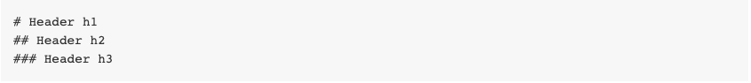  
            Kết quả:  
            + # Header 1
            + ## Header 2
            + ### Header 3
            
        2. Thứ hai:
            + Kẹp một từ ở đầu và cuối bằng 1 ký tự `*` để in nghiêng, 2 ký tự `**` để bôi đậm, và 3 ký tự `***` để vừa in nghiêng vừa bôi đậm. Nếu muốn chúng ta có thể dùng gạch dưới `_` thay cho dấu sao `*`.  
                Ví dụ:  
                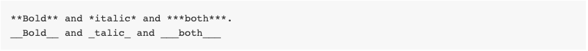  
                Kết quả:  
                + **Bold**  
                + *italic*  
                + ***both***  
                
            + Ngoài ra chữ có thể gạch ngang bằng 2 dấu ~~.  
                Ví dụ:  
                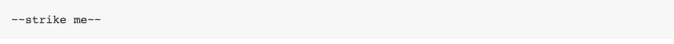  
                Kết quả:  
                + ~~strike me~~
                
        3. Thứ ba:
            + Viết link trong markdown bằng cách cho alt text vào trong ngoặc vuông `[]` và link thật vào trong ngoặc đơn `()`.  
                Ví dụ:  
                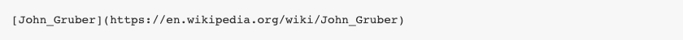  
                Kết quả:  
                + [John_Gruber](https://en.wikipedia.org/wiki/John_Gruber)
                
            + Ngoài ra chúng ta có thể thêm tiêu đề cho link bằng cách thêm "title" trong mô tả bên trong ngoặc đơn ().  
                Ví dụ:  
                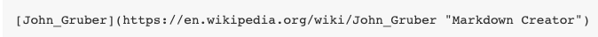  
                Kết quả:  
                + [John_Gruber](https://en.wikipedia.org/wiki/John_Gruber "Markdown creator")

        4. Thứ tư: Chèn hình ảnh trong markdown chỉ khác với chèn link đôi chút. Chúng ta thêm ký tự `!` vào đầu tiên, sau đó ghi alt text và link ảnh vào trong ngoặc vuông `[]` và ngoặc đơn `()`. Nhưng trong trường hợp sử dụng Kipalog để biên dịch thì chúng ta chỉ việc kéo, thả hoặc là copy và paste ảnh trực tiếp vào editor để bắt đầu upload.  
            Ví dụ:  
            ```markdown
            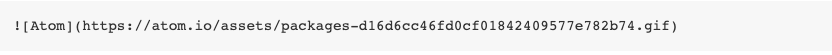
            ```  
            Kết quả:  
            
            
        5. Thứ năm: Để định đạng một đoạn văn bản thành các gạch đầu dòng trong markdown, chúng ta dùng ký tự `*` và một dấu cách ở mỗi ý và dùng thêm 2 dấu cách ở đằng trước nếu muốn lùi vào một level. Nếu muốn dùng số để đánh dấu thì chúng ta viết số và một dấu chấm.  
            Ví dụ:  
            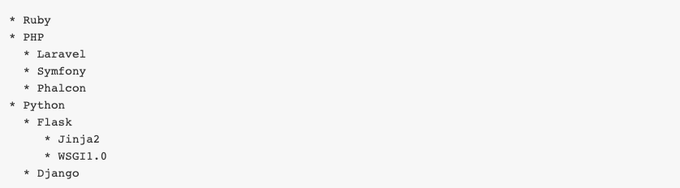
            Danh sách với số:  
            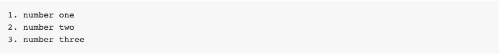
            
        6. Thứ sáu: Cách viết một trích dẫn giống hệt khi chúng ta vẫn trả lời bình luận hay dẫn chứng trong các diễn đàn: sử dụng ký tự ``.  
            Ví dụ:  
            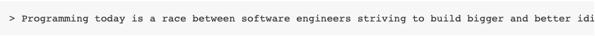
            
        7. Thứ bảy: Áp dụng màu sắc cho văn bản. Việc này khá đơn giản, chúng ta có thể sử dụng thẻ font và sử dụng color của thẻ này như ví dụ sau <font color="red">Thử màu</font>.  
            Ví dụ:  
            ```markdown
            <font color="red">Thử màu</font>.
            ```
        8. Thứ tám: Để enter xuống dòng thì chúng ta sử dụng hai lần khoảng trắng thay vì ấn enter.
    * Ngữ pháp nâng cao của Markdown: Kể từ đây sẽ là các cú pháp thuộc phần nâng cao. Một số trong số này không được hỗ trợ trực tiếp bởi Markdown, nhưng được hỗ trợ bởi Kipalog.
        1. Thứ nhất: Mã code. Có 2 loại code có thể viết trong markdown: inline code (code trong dòng) và code block (đoạn code riêng). Còn code block dùng 3 ký tự phẩy ngược kẹp ở đầu và đuôi của 1 đoạn. Khi bạn muốn cú pháp hiển thị chính xác với ngôn ngữ của đoạn code thì có thể thêm định danh ngôn ngữ ở 3 ký tự phẩy ngược mở đoạn. Ngoài ra nếu cách đầu dòng 4 dấu cách cho 1 đoạn thì đoạn đó cũng sẽ được tự động nhận là một code block.  
            Ví dụ:  
            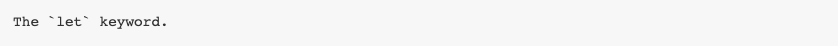
            Nhập vào:  
            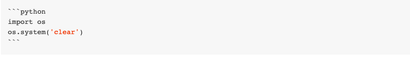
            Kết quả:  
            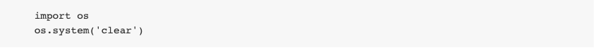
            
        2. Thứ hai: Vẽ bảng trong Markdown sẽ hơi khó nếu bạn chưa quen. Các cột được tách nhau bằng dấu ngăn thẳng đứng | và header được tách với content bằng dấu gạch ngang -. Ở dòng ngăn cách giữa header và content bạn sẽ thấy ký hiệu căn lề trái phải (cột 2 và cột 3) bằng dấu :. Bảng trên sẽ được render thành cấu trúc HTML. Trong trường hợp chưa quen với việc kẻ bảng với markdown thì chúng ta có thể sử dụng hỗ trợ từ [link này](https://www.tablesgenerator.com/markdown_tables).  
            Ví dụ:  
            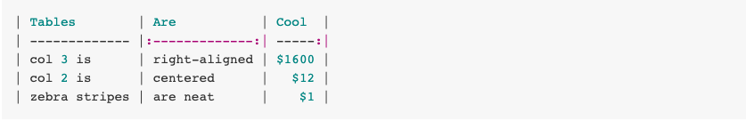  
            Kết quả:  
            | Tables        | Are           | Cool  |
            | ------------- |:-------------:| -----:|
            | col 3 is      | right-aligned | $1600 |
            | col 2 is      | centered      |   $12 |
            | zebra stripes | are neat      |    $1 |            
        3. Thứ ba: Link tài liệu tham khảo. Markdown được thiết kế để dễ nhìn ngay ở định dạng tự nhiên. Vì vậy chúng ta có thể đánh dấu mỗi link thành từng số và viết tất cả link thực tương ứng với các số ở cuối cùng.  
            Ví dụ:  
            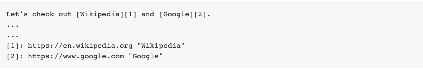
            
        4. Thứ tư: Link nhanh. Chúng thậm chí có thể viết link trực tiếp như là https://kipalog.com/posts/Huong-dan-su-dung-Markdown-tren-Kipalog.  
            Ví dụ:  
            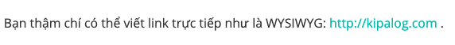
            
### Các extension và plugin của markdown.
* Như đã nói ở trên thì markdown có thể viết trên nhiều trình biên dịch khác nhau, miễn là chúng ta viết đúng cấu trúc và khi lưu hoặc xuất ra một file với đuôi .md hoặc .markdown là chúng ta đã soạn thảo được một file markdon. Kèm với đó phiên bản mới nhất của markdown là cách đây 15 năm trước, thế nên sẽ có nhiều việc bất tiện trong việc sử dụng. Tuy nhiên nhu cầu sử dụng file markdown còn rất cao, thế nên các chương trình biên dịch code ngày nay đã cung các extension và plugin để hỗ trợ người dùng soạn thảo một file markdown hiệu quả hơn. Hoặc một số công ty cũng đã có thiết kế một số phần mềm dành riêng cho việc soạn thảo một file markdown, và tất nhiên các ứng dụng này đã tích hợp sẵn các extension và các cú pháp nâng cao trong việc biên dịch một file markdown.
* Bây giờ chúng ta sẽ tới với các extension và plugin của một editor quen thuộc là VS-Code.
    + Extension 1: markdownlint. Markdownlint là một extension được cung cấp bởi VS-Code, bao gồm các thư viện về các quy tắc và các tiêu chuẩn cho việc soạn thảo một file markdown. **Cách sử dụng:** bất cứ khi nào chúng ta soạn thảo hoặc chỉnh sửa một file markdown thì cứ với bất kì một dòng nào vi phạm quy tắc của markdownlint thì lập tức sẽ được bật cảnh báo trong trình chỉnh sửa. Cảnh báo được biểu thị bằng một gạch dưới màu xanh lượn sóng và cũng có thể được nhìn thấy bằng cách nhấn Ctrl + Shift + M để mở hộp thoại Lỗi và Cảnh báo.  Di con trỏ chuột lên một đường màu lục để xem cảnh báo hoặc nhấn F8 và Shift + F8 để chuyển qua tất cả các cảnh báo (tất cả các cảnh báo markdownlint đều bắt đầu bằng MD ###). Để biết thêm thông tin về cảnh báo markdownlint, đặt con trỏ trên một dòng và nhấp vào biểu tượng bóng đèn hoặc nhấn Ctrl +. để mở hộp thoại hành động mã. Nhấp vào một trong các cảnh báo trong hộp thoại sẽ hiển thị mục trợ giúp của quy tắc đó trong trình duyệt web mặc định. [Quy tắc của markdownlint(Xem ở phần Rules).](https://marketplace.visualstudio.com/items?itemName=DavidAnson.vscode-markdownlint)
    + Extension 2: Markdown TOC. Extension cung cấp cho chúng ta các tiện ích sau:
        1. Chèn phần số cho tiêu đề.
        2. Tự động kích hoạt plugin trên markdown.
        3. Chèn neo cho tiêu đề.
        4. Liên kết thông qua các thẻ neo # A 1 → # a-1.
        5. Kiểm soát độ sâu [1-6] với độ sâuFrom: 1 và độ sâuTo: 6.
        6. Bật hoặc tắt liên kết với withLinks: true
        7. Làm mới danh sách lưu với updateOnSave: true.
        8. Sử dụng danh sách theo thứ tự (1. ..., 2. ...) với orderList: true.
        9. Hỗ trợ neo cho (github.com | nodejs.org | bitbucket.org | ghost.org | gitlab.com).
        * [Cách sử dụng.](https://marketplace.visualstudio.com/items?itemName=AlanWalk.markdown-toc&ssr=false#qna)
    + Extension 3: Markdown shortcuts. Với extension này thì chúng ta có thể định dạng file markdown một cách nhanh và hiệu quả nhất chỉ với vài cái click chuột. Dưới đây là một số câu lệnh mà extension cung cấp:
        | Name                            | Description                                      | Default key binding |
        |---------------------------------|--------------------------------------------------|---------------------|
        | md-shortcut.showCommandPalette  | Display all commands                             | ctrl+M ctrl+M       |
        | md-shortcut.toggleBold          | Make **bold**                                    | ctrl+B              |
        | md-shortcut.toggleItalic        | Make _italic_                                    | ctrl+I              |
        | md-shortcut.toggleStrikethrough | Make ~~strikethrough~~                           |                     |
        | md-shortcut.toggleLink          | Make [a hyperlink](www.example.org)              | ctrl+L              |
        | md-shortcut.toggleImage         | Make an image                  | ctrl+shift+L        |
        | md-shortcut.toggleCodeBlock     | Make ```a code block```                          | ctrl+M ctrl+C       |
        | md-shortcut.toggleInlineCode    | Make `inline code`                               | ctrl+M ctrl+I       |
        | md-shortcut.toggleBullets       | Make * bullet point                              | ctrl+M ctrl+B       |
        | md-shortcut.toggleNumbers       | Make 1. numbered list                            | ctrl+M ctrl+1       |
        | md-shortcut.toggleCheckboxes    | Make - [ ] check list (Github flavored markdown) | ctrl+M ctrl+X       |
        | md-shortcut.toggleTitleH1       | Toggle # H1 title                                |                     |
        | md-shortcut.toggleTitleH2       | Toggle ## H2 title                               |                     |
        | md-shortcut.toggleTitleH3       | Toggle ### H3 title                              |                     |
        | md-shortcut.toggleTitleH4       | Toggle #### H4 title                             |                     |
        | md-shortcut.toggleTitleH5       | Toggle ##### H5 title                            |                     |
        | md-shortcut.toggleTitleH6       | Toggle ###### H6 title                           |                     |
        | md-shortcut.addTable            | Add Tabular values                               |                     |
        | md-shortcut.addTableWithHeader  | Add Tabular values with header                   |                     |
        ****
    + Extension 4: Kể từ extension này trở đi sẽ là các extension hỗ trợ cho việc review. Markdown Preview Github Styling. Giúp chúng ta có một cách preview khác về markdown trên VS-Code giống với trên Github.  
        + Ví dụ
        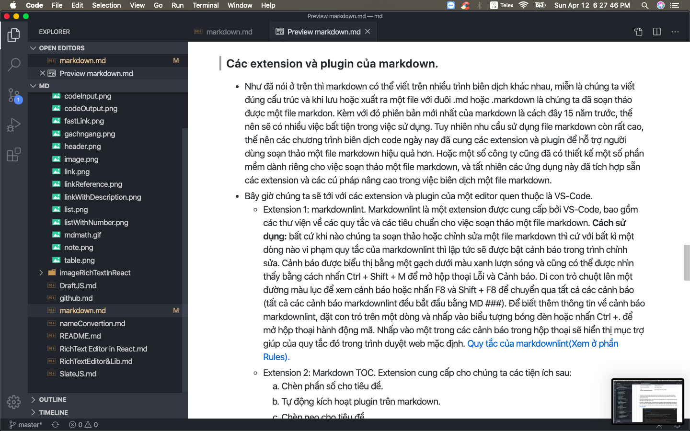 
        
    + Extension 5: Markdown Emoji. Thêm hỗ trợ cho: biểu tượng cảm xúc: cú pháp vào bản xem trước đánh dấu tích hợp sẵn của VS Code. 
        + Ví dụ:
        
        
    + Extension 6: Markdown+Math. Với extension này cho phép sử dụng Visual Studio Code làm trình chỉnh sửa đánh dấu có khả năng sắp chữ và kết xuất toán học TeX. Trong thực tế, nó sử dụng lại trình xem markdown tích hợp. KaTeX hoạt động bên trong như một trình kết xuất toán học nhanh. [Link tham khảo](https://marketplace.visualstudio.com/items?itemName=goessner.mdmath).  
        + Ví dụ
        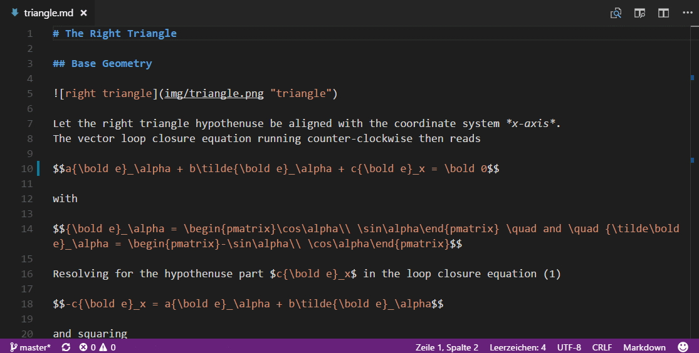
        
### Ưu và nhược điểm của file markdown.
* Ưu điểm:
    * Người dùng có thể vừa soạn thảo văn bản cùng với việc định dạng văn bản
    * Khắc phục được các syntax dài dòng và rườm rà của HTML.  
        * Ví dụ:
            HTML:   
            ```html
            <h4>Tại sao <em>bạn nên sử dụng markdown</em></h4>
            ```  
            Markdown:  
            ```markdown
            ##### Tại sao *bạn nên sử dụng markdown*
            ```  
            Kết quả:  
                    
    * Syntax thân thiện và dễ nhớ hơn cho người dùng phổ thông.
        * Ví du:  
        ```markdown
        ### Hello world  
        ### Tương đương thẻ h3 trong html
        ```
* Nhược điểm: 
    * Vì đã được phát triển rất lâu và phiên bản gần nhất là 15 năm trước nên người dùng cần phải cài đặt thêm các extension và plugin hỗ trợ.

### Tài liệu tham khảo.
1. [Hướng dẫn sử dụng mark down trên Kipalog.](https://kipalog.com/posts/Huong-dan-su-dung-Markdown-tren-Kipalog)
2. [Hướng dẫn sử dụng markdown cơ bản.](https://viblo.asia/p/markdown-huong-dan-su-dung-Az45bQPNlxY)


